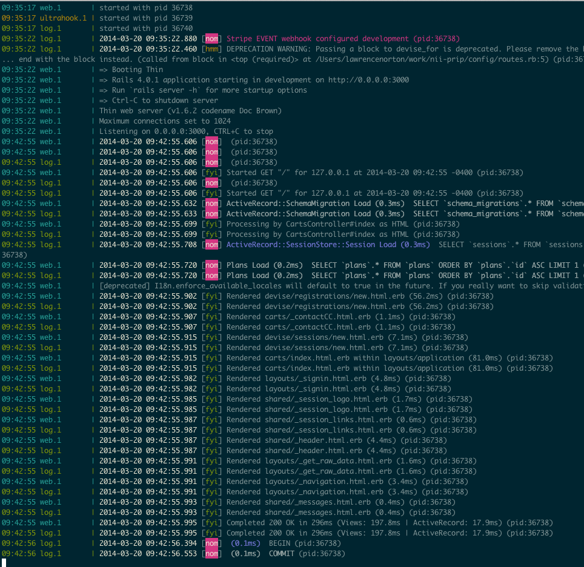

# ColoredLogger



## Installation

Add this line to your application's Gemfile:

    gem 'colored_logger'

And then execute:

    $ bundle

Or install it yourself as:

    $ gem install colored_logger

## Usage

Add color to any logger output using `Rails.logger.<debug|info|warn|error|fatal|unknown> "I am a string".<black|red|green|yellow|blue|magenta|cyan|white>`

Right now the colors for the logger severity are hardcoded but I will update soon. As of now they are

```
{'DEBUG'=>'0;37;45', 'INFO'=>'32', 'WARN'=>'33', 'ERROR'=>'31', 'FATAL'=>'31', 'UNKNOWN'=>'37'}
```

## Coming Soon

* Inverse colors/background
* Custom Severities
* Tagged Logs


## Contributing

1. Fork it ( http://github.com/<my-github-username>/colored_logger/fork )
2. Create your feature branch (`git checkout -b my-new-feature`)
3. Commit your changes (`git commit -am 'Add some feature'`)
4. Push to the branch (`git push origin my-new-feature`)
5. Create new Pull Request
